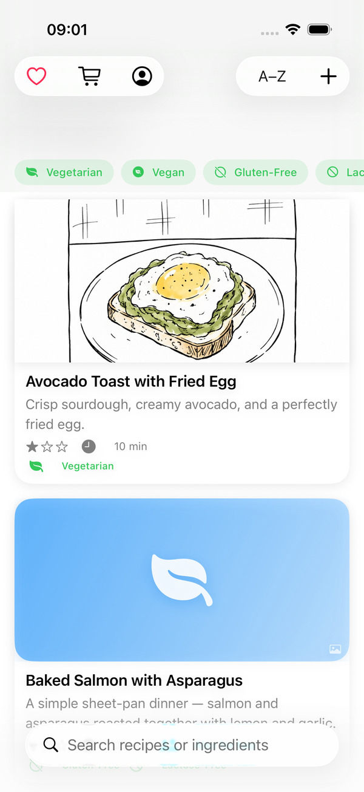
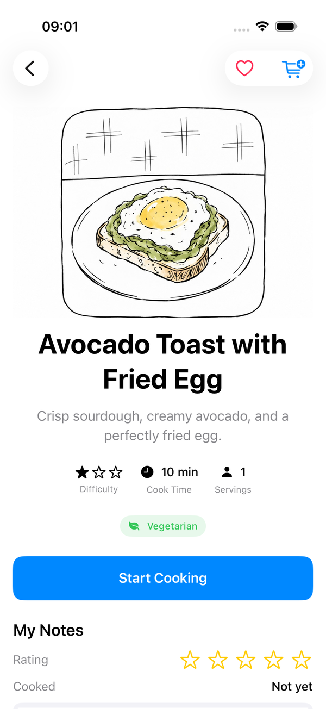
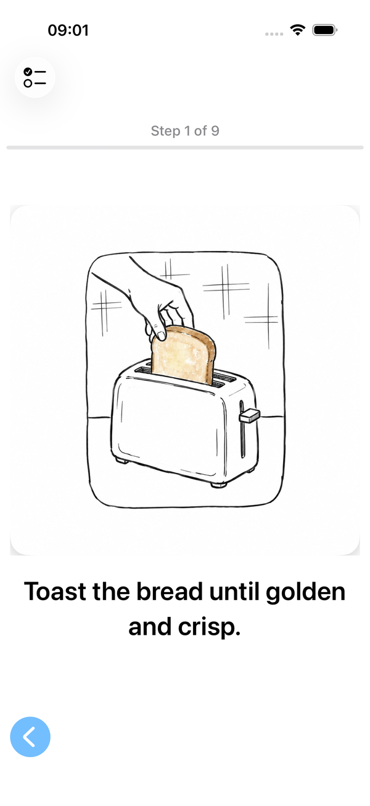

# Cooking App

**A recipe app built for cooking, not reading.**

Most recipe apps are written to be scrolled through on a couch, not glanced at with wet or
messy hands over a stove. Cooking App turns a recipe into a sequence of full-screen steps —
tap or swipe to move forward, one instruction at a time, with built-in timers and no walls of
text to hunt through mid-recipe.

Some recipes go further with **two-person mode**: two nearby iPhones sync live over
`MultipeerConnectivity` (no internet, no accounts, no backend) so two cooks can split labor on
the same dish — not just mirroring the same steps to both phones, but orchestrating parallel
tracks, like starting your onions now so they finish when your partner's sauce reduces.

<p align="center">
  
  
  
</p>

## Features

- **One step at a time.** Full-screen instructions with tap/swipe navigation, per-step timers
  with local notifications, and hold-to-finish gestures — built to be usable without touching the
  screen with clean hands.
- **Two-person cooking.** Host/join over the local network, with each phone showing its own
  track of steps and live partner progress — for recipes that have been hand-authored with a real
  split, not a generic mirror of the solo steps.
- **Recipe browsing.** Search by title or ingredient, filter by dietary tag, sort, favorite, and
  scale servings live (ingredient amounts recompute as you adjust the stepper).
- **Create your own recipes**, with a full editor for ingredients, steps, and two-person splits.
- **Shopping list** that snapshots ingredients from any recipe, independent of later edits to it.
- **Resume Cooking** — a solo session survives a force-quit and picks back up at the exact step
  and timer state.
- **A real first-run walkthrough** — an interactive spotlight tour that only advances once you've
  actually used the control it's pointing at, not a static set of onboarding slides.
- **Accessibility as a first-class concern**, not an afterthought: every screen has been audited
  for VoiceOver (combined list rows, labeled icon-only buttons, step/timer/partner-state
  announcements), Dynamic Type, and Voice Control.

## Why it's built this way

- **A two-package layout** (`CookingAppCore` + `CookingApp`) so all business logic — recipe
  scaling, session/timer state, the sync protocol — is a plain Swift package with zero
  UIKit/SwiftUI, fully unit-testable without booting a simulator. 222 tests run in under a
  second with `swift test`.
- **A tested networking layer.** `PeerSyncService` wraps `MultipeerConnectivity` so every
  delegate callback is a thin pass-through to an internal, synchronous handler — the two-person
  sync logic is exercised by real unit tests instead of only manual device testing.
- **SwiftData for one real store.** Sample recipes are plain Swift value literals used only as
  seed data; the running app always reads from a single on-device store, with additive-by-id
  seeding so app updates never wipe a user's favorites, notes, or ratings.

See [`instructions.md`](instructions.md) for the full architecture breakdown, file-by-file notes,
and known limitations — it's written to onboard a new contributor to the codebase, not just to
describe features.

## Getting started

1. Clone the repo, keeping `CookingApp/` and `CookingAppCore/` as sibling folders (the app target
   depends on the Core package via a relative path).
2. Open `CookingApp/CookingApp.xcodeproj` in Xcode (the project itself is generated from
   `CookingApp/project.yml` via [XcodeGen](https://github.com/yonaskolb/XcodeGen); you only need
   to regenerate it if you add a source file or change `project.yml`).
3. In the `CookingApp` target's Signing & Capabilities, set your own Apple ID as the team.
4. Run on a Simulator for solo recipes. **Two-person mode needs two physical iPhones** — the
   Simulator has no Bluetooth/local-network radio to actually pair with.

### Running the tests

```bash
cd CookingAppCore && swift test
```

`CookingAppCoreTests` is the real test suite — 222 tests covering every file in Core. A separate
`CookingAppUITests` target (XCUITest) exercises real touch-driven flows against the running app.

## Tech

Swift · SwiftUI · SwiftData · MultipeerConnectivity · UserNotifications · XcodeGen · SwiftLint

## Project status

Feature development is paused for now while I focus on a job search, but the app is fully
functional end to end — solo and two-person cooking, the recipe editor, shopping list, and the
onboarding tour all work. `instructions.md` lists the concrete next steps (a two-person split
editor, per-step photos, CloudKit sync) if you're curious where it was headed.

## License

MIT — see [LICENSE](LICENSE).
