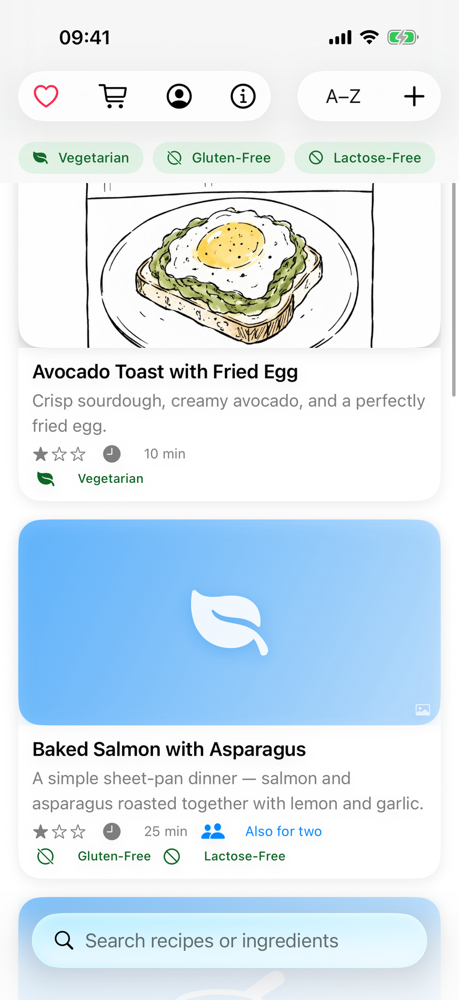
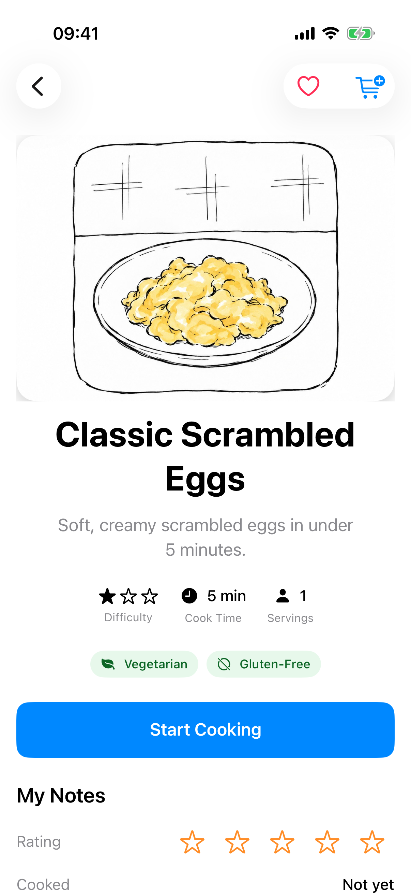
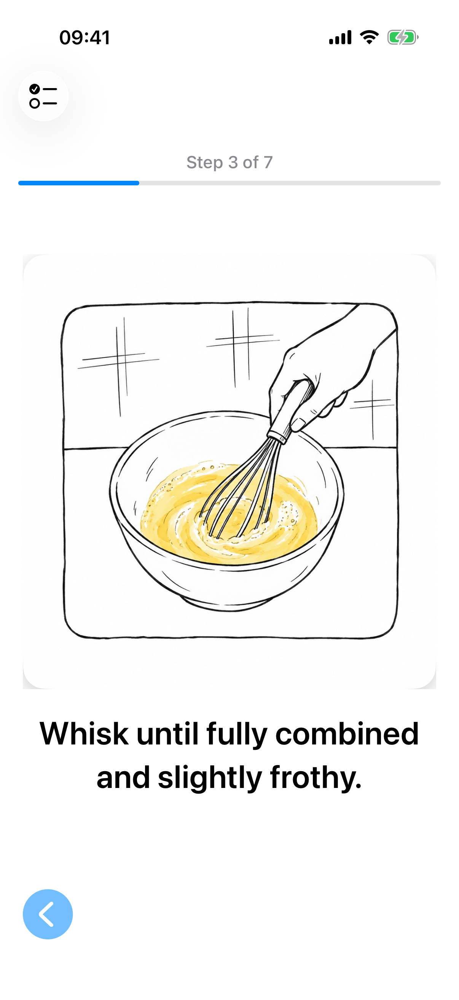

# Cooking App

[](https://github.com/yahiaelsamman/cooking-app/actions/workflows/ci.yml)

**A recipe app built for cooking, not reading.**

Most recipe apps are written to be scrolled through on a couch, not glanced at with wet or
messy hands over a stove. Cooking App turns a recipe into a sequence of full-screen steps —
tap or swipe to move forward, one instruction at a time, with built-in timers and no walls of
text to hunt through mid-recipe.

Some recipes go further with **two-person mode**: two nearby iPhones sync live over
`MultipeerConnectivity` (no internet, no accounts, no backend) so two cooks can split labor on
the same dish — not just mirroring the same steps to both phones, but orchestrating parallel
tracks, like starting your onions now so they finish when your partner's sauce reduces.

<p align="center">
  
  
  
</p>

## Features

- **One step at a time.** Full-screen instructions with tap/swipe navigation, per-step timers
  with local notifications, and hold-to-finish gestures — built to be usable with messy hands. The screen stays
  awake while you cook, and an ingredient checklist and "How do I check?" doneness hints are one
  tap away.
- **Two-person cooking.** Host/join over the local network, with each phone showing its own
  track of steps and live partner progress — for recipes that have been hand-authored with a real
  split, not a generic mirror of the solo steps.
- **Recipe browsing.** Search by title or ingredient, filter by dietary tag, sort, favorite, and
  scale servings live (ingredient amounts recompute as you adjust the stepper).
- **Create your own recipes** with an editor for ingredients, steps and timers (solo recipes;
  two-person splits are hand-authored for the bundled recipes — 13 of the 20 have one).
- **Shopping list** that snapshots ingredients from any recipe, independent of later edits to it.
- **Resume Cooking** — a solo session survives a force-quit and picks back up at the exact step
  and timer state.
- **A real first-run walkthrough** — an interactive spotlight tour that only advances once you've
  actually used the control it's pointing at, not a static set of onboarding slides.
- **An About screen** (info button in the recipe list) with the app version, a plain-language
  privacy statement, and credits. Two-person mode explains the Local Network prompt before iOS shows it.
- **Accessibility built in from the start:** VoiceOver labels, combined rows, and announcements
  for step, timer, and partner changes; Dynamic Type; Voice Control input labels; Reduce Motion.
  Checked in code and the Simulator, not yet with VoiceOver on a physical device.
- **Artwork is partial.** Three recipes (Scrambled Eggs, Avocado Toast, Grilled Cheese) have
  AI-generated step-by-step illustrations in a hand-drawn style, five more have stock hero photos
  from Pexels, and the rest use a placeholder card for now.

## Why it's built this way

- **A two-package layout** (`CookingAppCore` + `CookingApp`) so all business logic — recipe
  scaling, session/timer state, the sync protocol — is a plain Swift package with zero
  UIKit/SwiftUI, fully unit-testable without booting a simulator. The full test suite runs in a few
  seconds with `swift test`.
- **A tested networking layer.** `PeerSyncService` wraps `MultipeerConnectivity` so every
  delegate callback is a thin pass-through to an internal, synchronous handler — the two-person
  sync logic is exercised by real unit tests instead of only manual device testing.
- **SwiftData for one real store.** Sample recipes are plain Swift value literals used only as
  seed data; the running app always reads from a single on-device store, with additive-by-id
  seeding so app updates never wipe a user's favorites, notes, or ratings.

See [`instructions.md`](instructions.md) for the full architecture breakdown, file-by-file notes,
and known limitations — it's written to onboard a new contributor to the codebase, not just to
describe features.

## Requirements

- Xcode 26 or later (Swift 6.2, iOS 26 SDK). The app's deployment target is iOS 17.
- Full Xcode must be the active developer directory (`sudo xcode-select -s /Applications/Xcode.app`)
  — Command Line Tools alone can't load SwiftData's macros, so `swift test` fails.
- [XcodeGen](https://github.com/yonaskolb/XcodeGen) only if you add or remove source files.

## Getting started

1. Clone the repo, keeping `CookingApp/` and `CookingAppCore/` as sibling folders (the app target
   depends on the Core package via a relative path).
2. Open `CookingApp/CookingApp.xcodeproj` in Xcode (the project itself is generated from
   `CookingApp/project.yml` via [XcodeGen](https://github.com/yonaskolb/XcodeGen); you only need
   to regenerate it if you add a source file or change `project.yml`).
3. Simulator builds need no signing. To run on a device, set your own team in the `CookingApp`
   target's Signing & Capabilities **and** change the bundle identifier (e.g.
   `com.<you>.cookingapp`). If you regenerate with XcodeGen, change `DEVELOPMENT_TEAM` and
   `PRODUCT_BUNDLE_IDENTIFIER` in `CookingApp/project.yml` instead.
4. Run on a Simulator for solo recipes. Two-person mode is designed for, and tested on, two
   physical iPhones.

### Running the tests

```bash
cd CookingAppCore && swift test
```

`CookingAppCoreTests` is the real test suite, covering the Core package's logic. A
separate `CookingAppUITests` target (XCUITest) exercises real touch-driven flows against the running app. It is not run in CI; run it from Xcode with Cmd+U or via `xcodebuild test` (see instructions.md for the exact command and the no-`timeout` note).

## Tech

Swift · SwiftUI · SwiftData · MultipeerConnectivity · UserNotifications · XcodeGen · SwiftLint

## Project status

Feature development is paused for now while I focus on a job search, but the app is fully
functional end to end — solo and two-person cooking, the recipe editor, shopping list, and the
onboarding tour all work. It isn't on the App Store; build it from source to try it.
`instructions.md` lists the concrete next steps (a two-person split editor, illustrations for the
remaining recipes, CloudKit sync) if you're curious where it was headed.

## License

MIT — see [LICENSE](LICENSE) and [CREDITS.md](CREDITS.md). Recipe photos are from [Pexels](https://www.pexels.com/license/)
and the illustrations were AI-generated; neither is covered by the MIT license.
